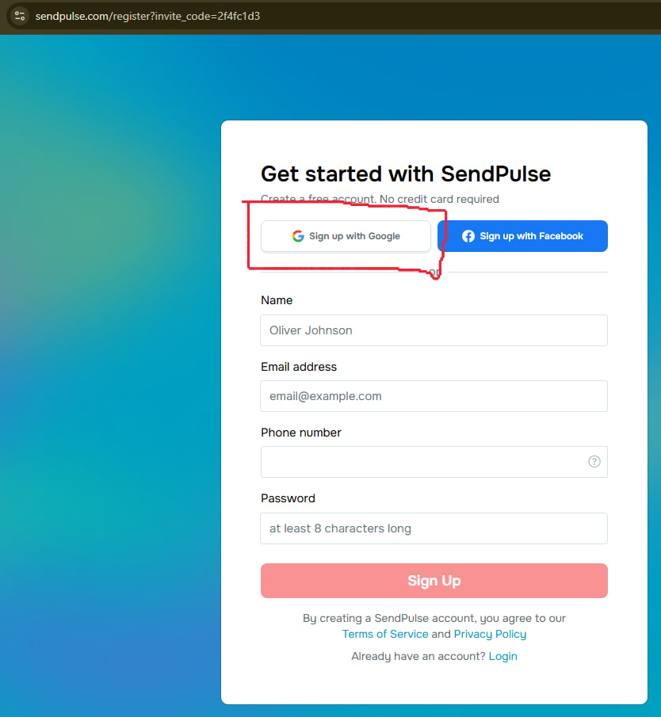
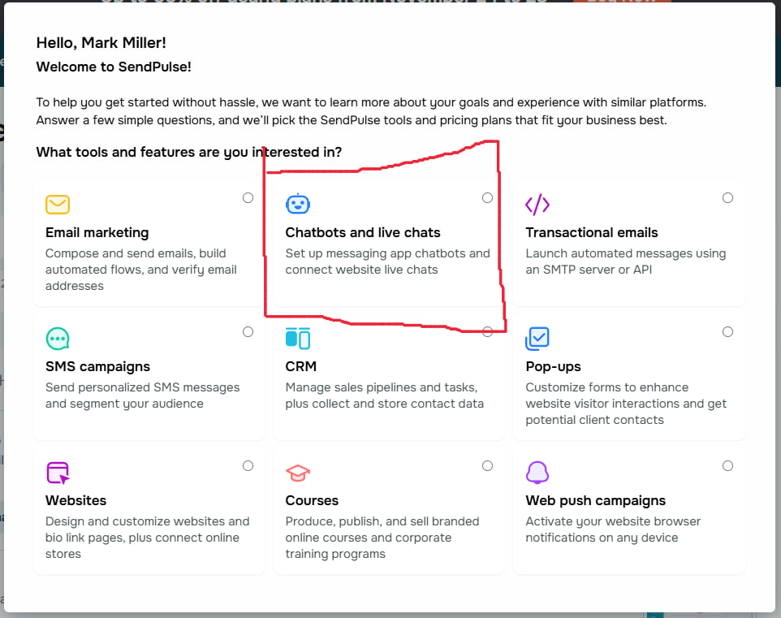
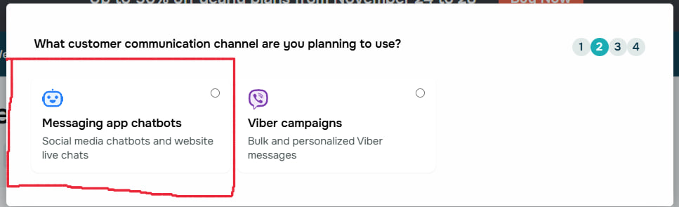
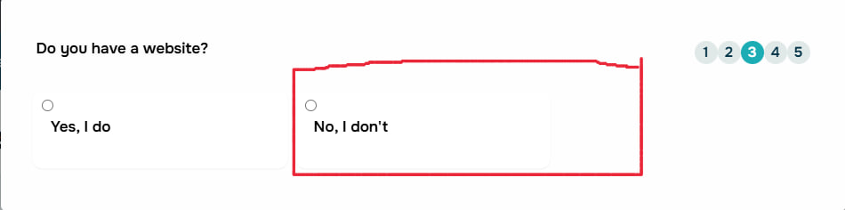
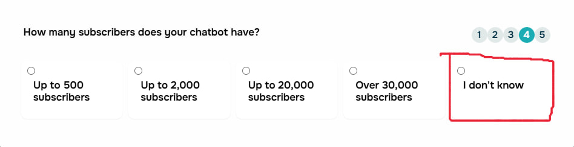

👋 Вам на почту пришло письмо вида

Нажимаем Accept the invitation

Попадаем на страницу регистрации

Sign up with Google
При входе обязательно выбираем ту почту, на которую пришло письмо!

После регистрации нам предлагают ввести номер

— Вводим любые цифры, главное — чтобы совпадало количество
— Ставим галочку I accept…
— Проходим капчу I'm not a robot
— Жмём Registration

Меню первого входа — выбираем интересы

Выбираем Chatbots and live chats

Messaging app chatbots

No, I don't

I don't know

Business purposes
Ниже выбираем первую строку — IT business or startup

Здесь просто в правом верхнем углу нажимаем Back

Ура, мы в главном меню! Нужно сменить команду

Нажимаем на иконку аккаунта справа

На стрелочку справа от My Team

Выбираем Lennon Dixon's Team

Добро пожаловать в рабочее пространство!

Интересуют только два пункта:

Conversations

virtual-cryptocurrency-bank.com

Первое — список чатов
Второе — общий список + инфо

Conversations

— Впервые написавший клиент, если залогинен, сразу показывает e-mail и ID
— Новый клиент = статус Unassigned
— Если почта совпадает с вашей — подвязываем
— Если нет — не трогаем, это сделает агент
— E-mail клиента также виден в правом нижнем углу или в панели virtual-cryptocurrency-bank.com

🎉 Финал

Если гайд помог — отлично.
Если нет — сделаем вид, что так и было задумано. 🙃

Спасибо, что прошли весь путь до конца — это уже больше, чем делают 90% пользователей, открывших инструкцию. 👀
