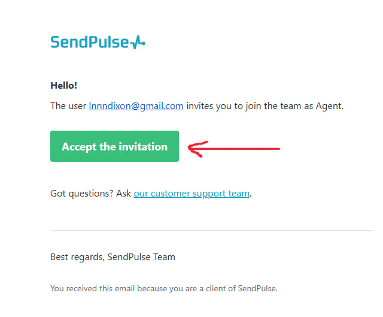
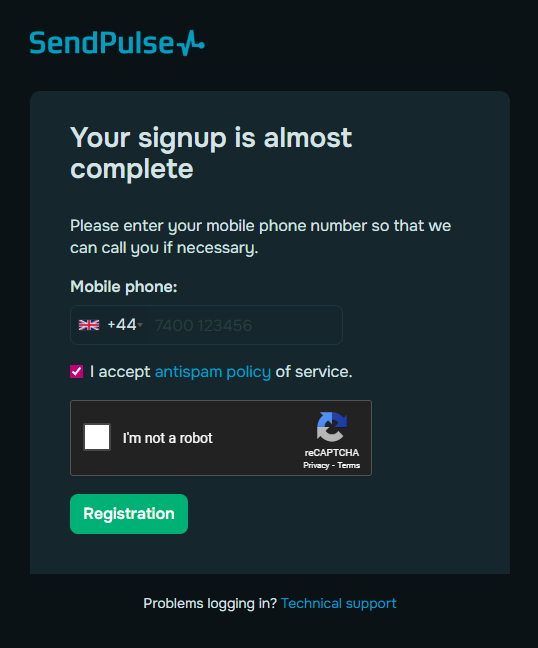
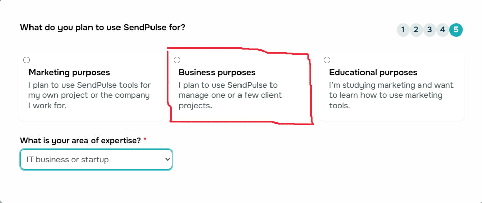
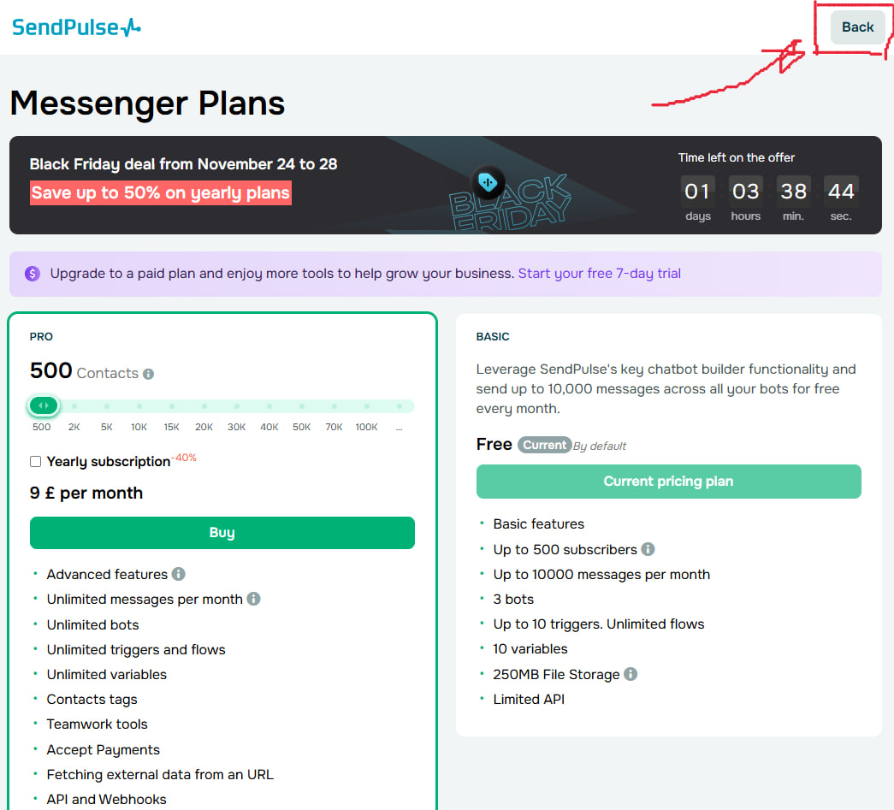
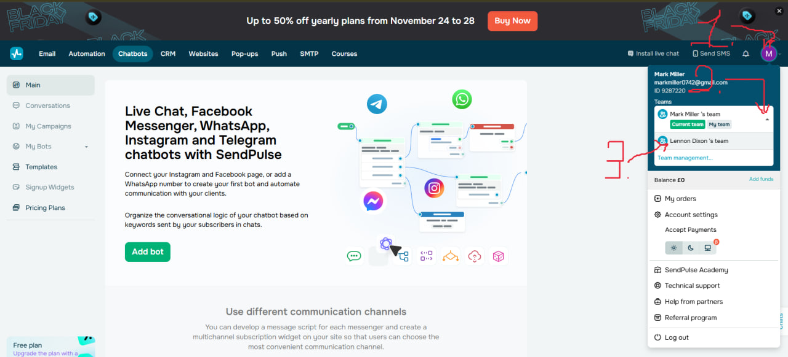
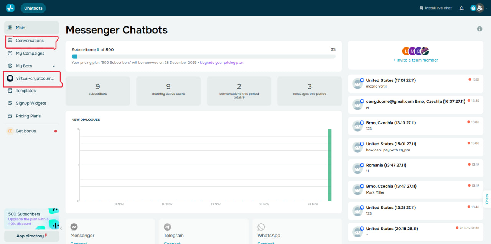
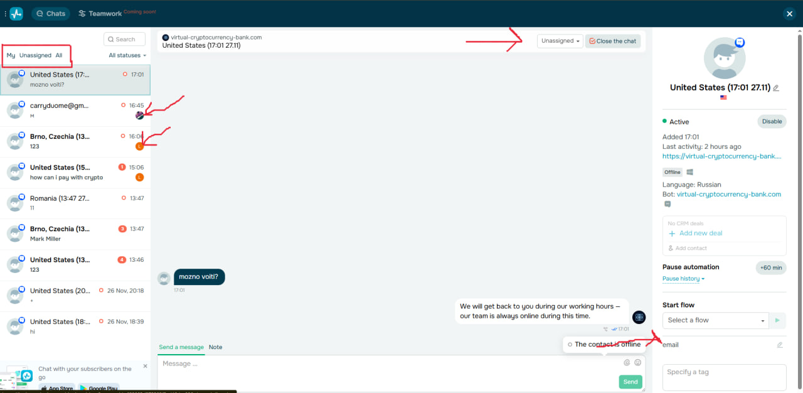

# 👋 Вам на почту пришло письмо вида : 

	
	Нажимаем Accept the invitation

# Попадаем на страницу регистрации :

	Sign up with Google
	При входе Обязательно выбираем ту почту на которую пришло письмо !
# После регистрации нам предлагают ввести номер :

	Вводим любые цифры главное что бы совпадало кол-во
	Галочку - i accept ....
	Проходим капчу I'm not a robot
	Жмём Registration
# Попадаем в меню первого входа, предлагается выбрать интересы, этого не избежать ... :

	Выбираем Chatbots and live chats

	Messaging app chatbots

	No, I don't

	I don't know

	Business purposes
	Ниже выбираем первую строку - IT business or startup

	Здесь просто в правом верхнем углу нажимаем - Back
# Ура, мы в главном меню !!! Нужно сменить команду :

	1. Нажимаем на иконку аккаунта справа 
	2. На стрелочку справа от "My Team"
	3. Выбираем ==**Lennon Dixon's Team**==
# Отлично, вы умнички и попали в ваше основное рабочее пространство !)

	Здесь нам интересно только 2 пункта :
	1. ==Conversations==
	2. ==virtual-cryptocurrency-bank.com==
	Первое - развернутый список чатов с клиентами
	Второе - тот же список чатов, но с общей информацией
# ==Conversations==

	Впервые написавший клиент, если он залогинен сразу покажет свой имейл и ID указанные при регистрации в банке. 
	- Новый клиент поступает в статусе  - Unassigned. Если вы видите что почта совпадает с почтой вашего клиента - подвязываете под себя, если не совпадает, не трогаете, агент чей это Лид подвяжет его под себя.
	- Уже подвязанные клиенты имеют статус и иконку Агента который их подвязал.
	- Имейлы клиентов, если они уже зарегистрированы можно увидеть в правом нижнем углу и в панели - ==virtual-cryptocurrency-bank.com==
# Если гайд помог — отлично. Если нет — сделаем вид, что так и было задумано. 🙃
Спасибо, что прошли весь путь до конца — это уже больше, чем делают 90% пользователей, открывших инструкцию. 👀
